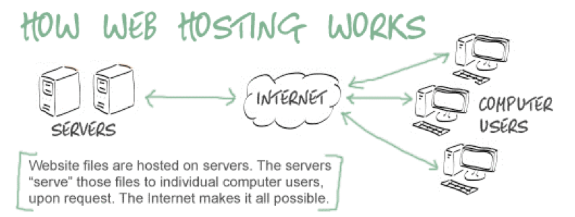

# Frequently Asked Questions (FAQ) about web

---

### Basics
1. **What is internet?**
   - a global network of computer networks that connects millions of devices and computers around the world
   - internet is based on a set of protocols and standards known as the [Internet Protocol Suite (TCP/IP)](https://en.wikipedia.org/wiki/Internet_protocol_suite) which enables data to be transmitted between devices and networks
   - origins of the internet date back to the 1960s, when the U.S. Department of Defense developed a network called [ARPANET](https://en.wikipedia.org/wiki/ARPANET)
1. **What is web?**
   - the term "web" typically refers to the [World Wide Web](https://en.wikipedia.org/wiki/World_Wide_Web) (WWW), which is a system of interlinked hypertext documents that are accessed through the internet
   - The WWW was created by [Tim Berners-Lee](https://en.wikipedia.org/wiki/Tim_Berners-Lee) in 1989 as a way to share information among researchers at [CERN](https://en.wikipedia.org/wiki/CERN)
   - It has since become a global platform for information exchange, communication, and commerce.
1. **How does web work?**
   - The web consists of a vast collection of web pages and websites that are hosted on servers all over the world. 
   - These pages are linked together by hyperlinks, which allow users to navigate between pages and websites by clicking on links. 
   - The web is accessed through web browsers such as Chrome, Firefox, and Safari, which interpret and display web pages to users.
1. **What is web page, website, web application and web system?**
   - Web page: A document that is part of a website and is designed to be displayed in a web browser.
   - Web site: A collection of related web pages that are hosted on a web server and can be accessed through the internet.
   - Web application: A software application that is accessed over the internet through a web browser or a web-based interface.
   - Web system: A broader term than a web application, as it includes all types of software systems that can be accessed over the internet.
1. **What is domain name?**
   - A domain name is a unique and human-readable identifier that is used to locate and access a "website" on the internet. 
   - It is essentially the address of a website, similar to a physical address of a building. 
   - Domain names are used to identify and distinguish one website from another.
1. **What is domain hosting? (or web hosting)**
   - a service that allows individuals and organizations to make their website accessible on the internet. 
   - It involves storing the files and data that make up a website on a server that is connected to the internet, 
   - so that anyone with an internet connection can access the website by entering its domain name in a web browser.

